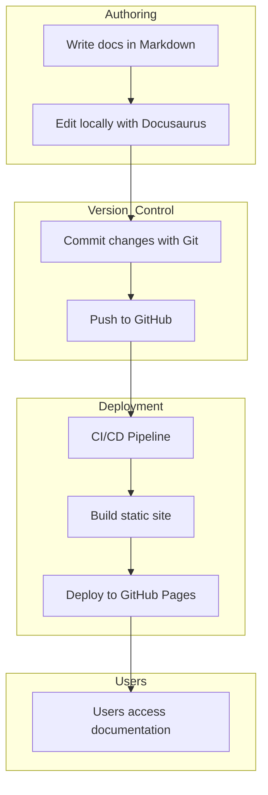

# Docs-as-code workflow
## How it works

1. Documentation is written in Markdown using Docusaurus.
2. Changes are tracked using Git.
3. The content is pushed to GitHub.
4. A deployment process builds the static website.
5. The site is published and accessible to users.

This diagram shows how documentation is written, versioned, and deployed using a modern docs-as-code approach.

:::tip
This workflow is used by many modern documentation teams to ensure version control, automation, and scalability.
:::